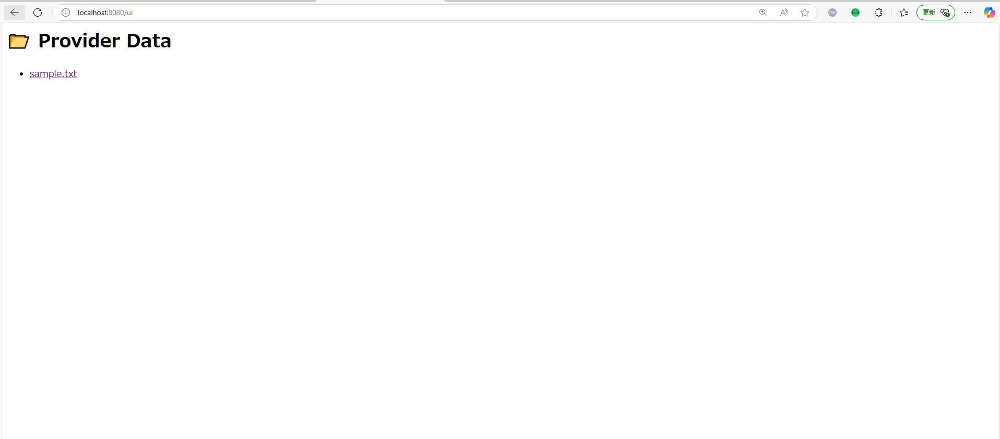

## 本リポジトリについて

- このリポジトリは、[sovity/edc-ce](https://github.com/sovity/edc-ce)をベースに構築されています。

- 元リポジトリは Elastic License 2.0 および Apache License 2.0 の混合ライセンスで公開されており、本リポジトリではソースコードのコピーや再配布は行わず、構成ファイル・データサーバ等の周辺資材を独自に構築・拡張しています。

- 本構成は学習・体験用途を想定しており、分かりやすく実践的な EDC のデモを目的としています。

- 本リポジトリの内容は Apache License 2.0 に基づいて公開しています。詳細は [LICENSE](LICENSE) をご覧ください。


## デモの概要
本デモでは、データ提供者側、データ利用者それぞれのコネクタを読者自身で操作し、データ交換の一連の流れを実施します。

## 前提条件
このデモを実行するには、以下のソフトウェアがインストールされている必要があります：
- Docker
- docker compose
- Git


## 環境構築手順
- 本章で構築する資材は以下の表のとおりです。

| コンポーネント種別 | クライアント端末からのアクセス方法 |
| --- | --- |
| データ提供者のデータサーバ | http://localhost:8080 |
| データ提供者のコネクタ | http://localhost:11000 |
| データ利用者のコネクタ | http://localhost:22000 |
| データ利用者のデータサーバ | http://localhost:8081 |

- リポジトリをCloneします。

```bash
git clone https://github.com/nttdata-dataspace/edc-demo-with-ui.git
```

- Dockerコンテナを構築します。

```bash
cd edc-demo-with-ui
mkdir consumer-data-server/data
docker compose up -d
[+] Running 10/10
 ✔ Container edc-demo-consumer-ui-1            Running                                                                     0.0s 
 ✔ Container edc-demo-consumer-connector-db-1  Healthy                                                                     4.2s 
 ✔ Container edc-demo-provider-connector-db-1  Healthy                                                                     4.7s 
 ✔ Container edc-demo-consumer-connector-1     Running                                                                     0.0s 
 ✔ Container edc-demo-provider-connector-1     Running                                                                     0.0s 
 ✔ Container edc-demo-consumer-1               Running                                                                     0.0s 
 ✔ Container edc-demo-provider-ui-1            Running                                                                     0.0s 
 ✔ Container edc-demo-provider-1               Running                                                                     0.0s 
 ✔ Container edc-demo-consumer-data-server-1   Started                                                                     1.8s 
 ✔ Container edc-demo-provider-data-server-1   Started                                                                     1.9s
```

- それぞれのコンポーネントへのURLにブラウザからアクセスし、動作確認を行います。

| コンポーネント種別 | クライアント端末からのアクセス方法 |
| --- | --- |
| データ提供者のデータサーバ | http://localhost:8080 |
| データ提供者のコネクタ | http://localhost:11000 |
| データ利用者のコネクタ | http://localhost:22000 |
| データ利用者のデータサーバ | http://localhost:8081 |
- 以下のようなUIが確認出来たら、動作確認完了です。





## デモ手順

本章では、「Provider Data Server」にある「Sample.txt」を「Consumer Data Server」にコネクタ経由で転送するシナリオでデータ交換を行います。

分かりやすさのため、画面を2分割します。

| 画面 | コンポーネント | URL |
| --- | --- | --- |
| 左画面 | データ提供者のコネクタダッシュボード | http://localhost:11000 |
|  | データ提供者のデータサーバ | http://localhost:8080 |
| 右画面 | データ利用者のコネクタダッシュボード | http://localhost:22000 |
|  | データ利用者のデータサーバ | http://localhost:8081 |


### 1．データ提供者側の操作

まずは、左画面でデータ提供者の操作を行います。

データ提供者側は、データの在り処、およびデータの利用規約をカタログに登録する必要があります。

左ペインから「Create Data Offer」を選択し、以下の情報を入力します。他の情報はデフォルト値/空欄で問題ありません。本手順により、Provider Data Serverに格納されているデータに対して「すべての契約交渉を受け入れる」利用規約を紐づけることが出来ます。

- Data Offer Type/URL：http://provider-data-server:8080/files/sample.txt
- General Information/Title：Test


入力が完了したら、「Publish」を押下します。

左ペインの「Data Offers」を選択した際、作成した”test”というData OfferがあればOKです。

これでデータ提供者側の操作は以上です。

### 2. データ利用者側の操作

次に、右画面でデータ利用者の操作を行います。

左ペインの「Catalog Browser」を選択してください。先ほどデータ提供者が登録した「Test」というデータの情報が確認できます。


この「Test」を選択し、「Negotiate」ボタンを押下すると、データ提供者に対して契約交渉を行うことが出来ます。

以下は契約が成立した場合の画面です。


左ペインの「Contracts」を選択すると、先ほど成立した契約があることを確認できます。


「test」を選択し、「Transfer」を押下すると、データ提供者からデータ利用者へのデータ転送が開始されます。

なお、「Transfer」を押下した際に入力を求められるURLの値は「http://consumer-data-server:8080/upload 」 としてください。「Initiate Transfer」を押下すると、データ転送が開始されます。


データ利用者のサーバにデータが転送されたか確認してみましょう。先ほどまで何もなかったフォルダに、何かファイルが追加されていることが分かると思います。


このファイルを任意のエディタで開いてみると…データ提供者から無事データが届きました！


## ライセンス

このリポジトリは、[Apache License 2.0](./LICENSE) のもとで公開されています。

また、sovity が [GitHub Container Registry (ghcr.io)](https://ghcr.io) にて提供している Docker イメージを Elastic License 2.0 に基づいて使用しています。

本プロジェクトは非営利・教育目的の技術検証および紹介を目的としており、これらのイメージの再配布、改変、または商用提供（SaaS 等）は行っておりません。

本リポジトリに含まれる構成ファイルおよび Express ベースのデータサーバ実装などは独自に作成されたものであり、Apache License 2.0 のもとで提供されています。
