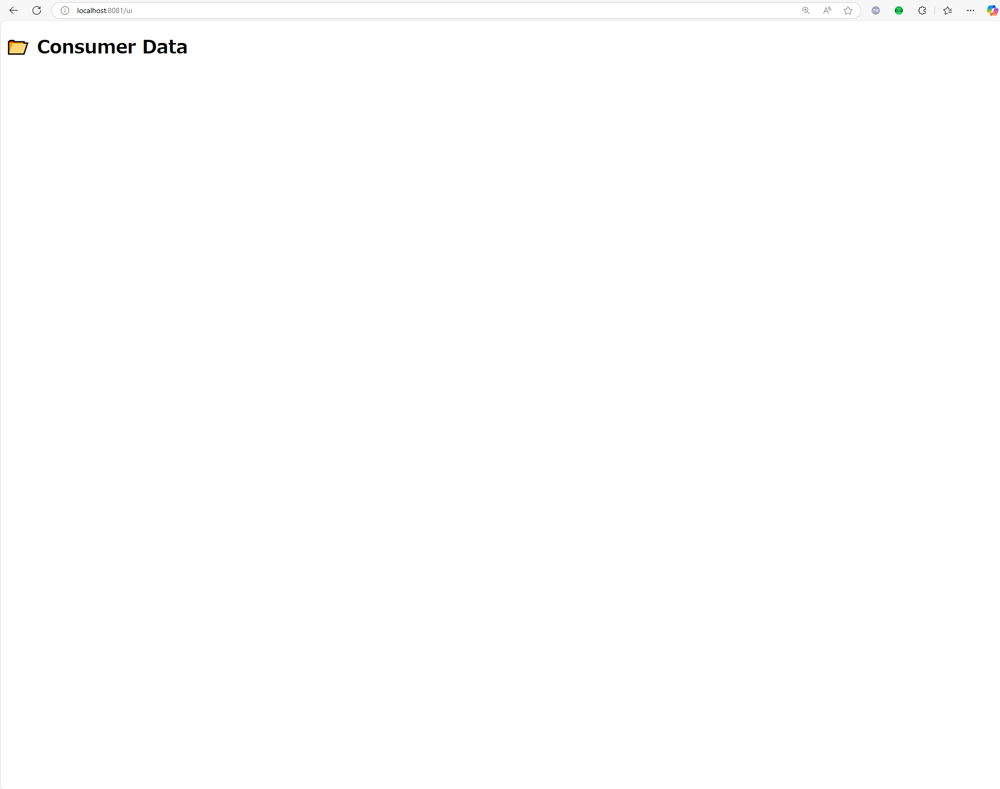
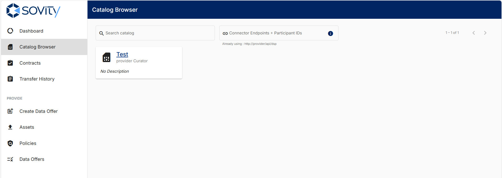
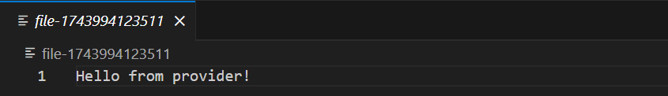

## About This Repository
- This Repository is based on [sovity/edc-ce](https://github.com/sovity/edc-ce).

- The original repository is published under a mixed license model: Elastic License 2.0 and Apache License 2.0.

- This repository does not include any copied or redistributed source code from the original.
Instead, it independently builds and extends configuration files and a data server implementation as supplemental components.

- This setup is intended for educational and hands-on learning purposes, providing an easy-to-follow and practical EDC demonstration.

- The content of this repository is released under the [Apache License 2.0](./LICENSE).

## Demo Overview

In this demo, you will operate both the data provider and data consumer connectors by yourself
and go through the entire data exchange process step by step.

## Prerequisites
To run this demo, you will need to have the following software installed:

- Docker

- Docker Compose

- Git

## Setup Instructions
- The following components will be built as part of this setup:

| Component Type | Access URL from Localhost |
| --- | --- |
| Data Provider's Data Server | http://localhost:80 |
| Data Provider's Connector | http://localhost:11000 |
| Data Consumer's Connector | http://localhost:22000 |
| Data Consumer's Data Server | http://localhost:81 |

- Clone this repository.

```bash
git clone https://github.com/nttdata-dataspace/edc-demo-with-ui.git
```

- Launch the Docker containers:
```bash
cd cd edc-demo-with-ui
mkdir consumer-data-server/data
docker compose up -d
[+] Running 10/10
 ✔ Container edc-demo-consumer-ui-1            Running                                                                     0.0s 
 ✔ Container edc-demo-consumer-connector-db-1  Healthy                                                                     4.2s 
 ✔ Container edc-demo-provider-connector-db-1  Healthy                                                                     4.7s 
 ✔ Container edc-demo-consumer-connector-1     Running                                                                     0.0s 
 ✔ Container edc-demo-provider-connector-1     Running                                                                     0.0s 
 ✔ Container edc-demo-consumer-1               Running                                                                     0.0s 
 ✔ Container edc-demo-provider-ui-1            Running                                                                     0.0s 
 ✔ Container edc-demo-provider-1               Running                                                                     0.0s 
 ✔ Container edc-demo-consumer-data-server-1   Started                                                                     1.8s 
 ✔ Container edc-demo-provider-data-server-1   Started                                                                     1.9s
```

- Open a browser and access the following URLs to confirm that each component is running properly:

| Component Type | Access URL from Localhost |
| --- | --- |
| Data Provider's Data Server | http://localhost:80 |
| Data Provider's Connector | http://localhost:11000 |
| Data Consumer's Connector | http://localhost:22000 |
| Data Consumer's Data Server | http://localhost:81 |

- If the following UIs appear, the setup has been completed successfully:




## Demo Instructions

In this section, you'll simulate a complete data exchange scenario where Sample.txt from the Provider Data Server is transferred to the Consumer Data Server via the connector infrastructure.

For better clarity, we recommend splitting your screen as follows:
| Screen side | Component | URL |
| --- | --- | --- |
| Left | 	Provider's Connector Dashboard | http://localhost:11000 |
|  | Provider's Data Server | http://localhost:8080 |
| Right | Consumer's Connector Dashboard | http://localhost:22000 |
|  | Consumer's Data Server | http://localhost:8081 |

### 1. Actions on the Provider Side
Start with the left screen and perform the steps as the **data provider**.

The provider needs to register the location of the data and define usage terms as a Data Offer in the catalog.

From the left menu, select **Create Data Offer**, and fill in the following fields. Other fields can be left as default or blank.

- **Data Offer Type/URL**: http://provider-data-server:8080/files/sample.txt

- **Title (General Information)**: Test


Once done, click Publish.

Then, go to the Data Offer tab in the left menu. If you see the newly created "Test" entry listed, you're good to go.

This completes the steps on the provider side.

### 2. Actions on the Consumer Side

Now switch to the right screen and operate as the data consumer.
Select Catalog Browser from the left menu. You should see the “Test” data offer published by the provider.

Select the "Test" offer and click the Negotiate button to initiate the contract negotiation.
If the contract is successfully established, you will see a confirmation like this:



Then, go to the Contracts tab and verify that the new contract appears.


Click on the "Test" contract and press Transfer to initiate the data transfer from the provider.
When prompted for the destination URL, enter the following:

```
http://consumer-data-server:8080/upload
```

Then click Initiate Transfer.


Now let’s check if the data has arrived at the consumer's server.
You should see a new file has appeared in the previously empty folder.


Finally, open the file using any text editor, and... 🎉
The data has been successfully delivered from the provider!



## License
- This repository is licensed under the Apache License 2.0.

- It also uses Docker images provided by sovity via GitHub Container Registry (ghcr.io), which are distributed under the Elastic License 2.0.

- This project is intended solely for educational and non-commercial technical demonstration purposes.
It does not redistribute, modify, or commercially offer any of the aforementioned images.

- All configuration files and Express-based data server implementations in this repository are independently created and released under the Apache License 2.0.